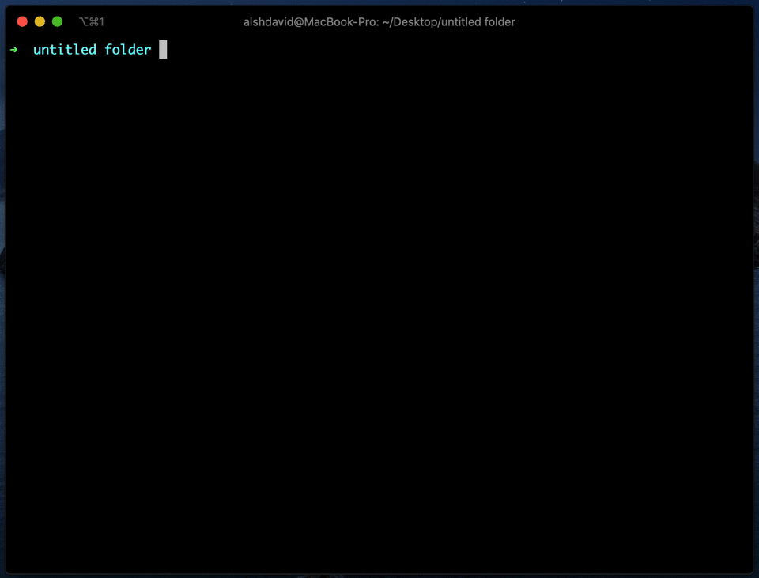

Lets you manage mono repos a little better by letting you run commands in parallel while managing the dependencies of those packages.


<br>

Commands:

```
npx npr
npx npm [npm script name]
```

Config file:

```javascript
// packages.config.js

const { Package, Options } = require('@alshdavid/npm-package-runner')

const a = new Package({
  alias: 'a',
  workingDir: [__dirname, 'packages', 'a'],
  readyWhenFiles: [ 'out.txt' ],
})

const b = new Package({
  alias: 'b',
  workingDir: [__dirname, 'packages', 'b'],
  readyWhenFiles: [ 'out.txt' ],
  dependsOn: [ a ]
})

const c = new Package({
  alias: 'c',
  workingDir: [__dirname, 'packages', 'c'],
  readyWhenFiles: [ 'out.txt' ],
  dependsOn: [ a, b ]
})

const d = new Package({
  alias: 'd',
  workingDir: [__dirname, 'packages', 'd'],
  readyWhenFiles: [ 'out.txt' ],
  dependsOn: [ a ]
})

const devServer = new Package({
  alias: 'server',
  workingDir: [__dirname, 'testing', 'dev-server'],
  readyWhen: [ 'tcp:8080' ],
  dependsOn: [ a ],
})

module.exports = {
  packages: [ a, b, c, d, devServer ],
  defaultActions: [
    { name: 'Clean Solution', commands: ['clean'] },
    { name: 'Build Solution', commands: ['clean', 'build'], options: [ Options.KillOthersOnFailure ] },
    { name: 'Develop Solution', commands: ['clean', 'dev'], options: [ Options.KillOthersOnFailure ] },
    { name: 'Only Watch Packages', commands: ['clean','watch'], options: [ Options.KillOthersOnFailure ] },
    { name: 'Only Run Server', commands: ['dev-server'], options: [ Options.KillOthersOnFailure, Options.NoPrefix ] },
  ]
}
```

